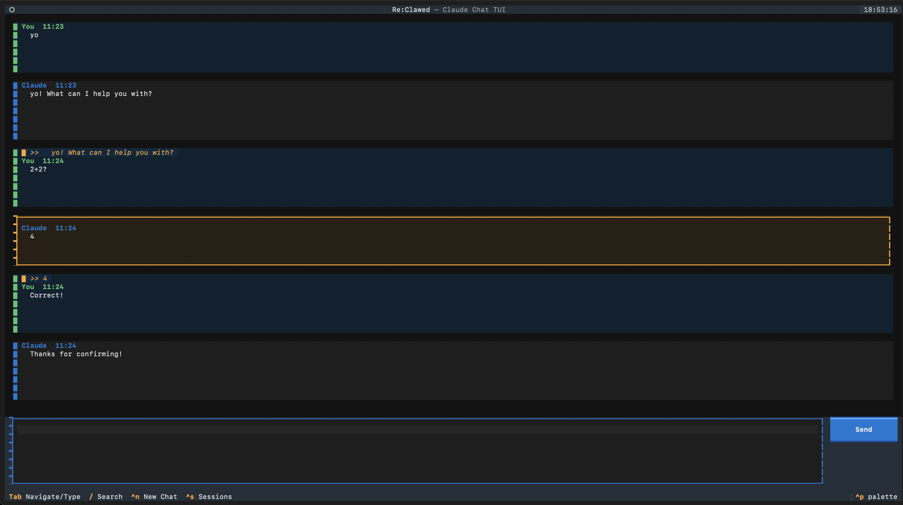

# Re:Clawed

A WhatsApp-style TUI for the Claude CLI. Reply to messages, quote, bookmark, run group chats, and manage sessions — all on top of your existing Claude Code subscription. No API key needed.



## Install

**Requires the `claude` CLI** — [install Claude Code](https://claude.ai/code) first.

```bash
git clone git@github.com:eddjharrison/reclawed.git
cd reclawed
python3.12 -m venv .venv
source .venv/bin/activate      # Windows: .venv\Scripts\activate
pip install -e .
```

**Optional — group chat tunneling** (lets remote participants join without port forwarding):

```bash
brew install cloudflared                    # macOS
winget install cloudflare.cloudflared       # Windows
sudo apt install cloudflared                # Debian/Ubuntu
```

## Quick Start

```bash
reclawed                  # open most recent session (or new chat)
reclawed --continue       # resume last session explicitly
reclawed --session <id>   # resume a specific session by ID
```

## Features

- **Streaming chat** — responses stream token-by-token with live markdown rendering
- **Reply to messages** — threaded replies with inline quote preview; click a reply indicator to jump to the original
- **Quote into compose** — paste a message excerpt directly into your input with `q`
- **Bookmark / pin** — toggle `b` to pin any message; `Ctrl+P` opens the pinned messages view
- **Session sidebar** — searchable session list with unread badges; toggle with `Ctrl+S`
- **Session management** — right-click any session for archive, mute/unmute, delete, mark-unread
- **Auto-naming** — sessions are automatically named from the first message so the sidebar stays readable
- **Relative timestamps** — message times shown as "just now", "5m ago", etc.
- **Multi-model switching** — cycle sonnet / opus / haiku with `F2`; persisted per session
- **Theme cycling** — dark / light / dracula / monokai with `Ctrl+T`
- **Session export** — dumps the full conversation to `~/Desktop/<name>.md` with `Ctrl+E`
- **Streaming speed indicator** — live tok/s counter in the status bar during generation
- **Copy to clipboard** — `c` in navigate mode; uses `pbcopy` (macOS) or `xclip` (Linux)
- **In-session search** — `/` searches all messages in the current session
- **Cost tracking** — cumulative session cost shown in the status bar
- **Group chat** — multi-participant rooms over WebSocket with automatic Cloudflare tunnel (see below)

## Group Chat

Group chat lets multiple people (each running their own Re:Clawed) share a conversation where every participant's local Claude responds. Messages from all humans and all Claude instances are broadcast to the room in real time.

**Create a group**

1. Press `Ctrl+G` and choose **Create**.
2. Re:Clawed starts an embedded WebSocket relay on `localhost:8765` (configurable).
3. If `cloudflared` is installed, a public `wss://...trycloudflare.com` tunnel is opened automatically — no port forwarding needed. Otherwise a LAN `ws://` URL is shown.
4. Copy the connection string and share it with participants.
5. Press **Start Chat** to enter the room.

**Join a group**

1. Press `Ctrl+G` and choose **Join**.
2. Paste the connection string you received.
3. Press **Join** or hit Enter.

**How it works**

Each participant connects to the same relay room. When you send a message it is broadcast to everyone and each participant's local `claude` CLI generates its own response, which is also broadcast. The relay server is a lightweight WebSocket hub with optional SQLite message log for store-and-forward (missed messages are replayed on reconnect). The client auto-reconnects with exponential backoff.

**@mention routing**

You can direct a message at a specific participant's Claude by @mentioning them:

```
@Ed's Claude what do you think about this architecture?
@Ed thoughts?
```

Ed's Re:Clawed detects the mention and has his Claude respond automatically. Both the full form (`@Ed's Claude`) and the short form (`@Ed`) are recognised, case-insensitively.

**Group respond modes (F3)**

Press `F3` at any time to cycle through four respond modes. The current mode is shown in the status bar as `[own]`, `[mentions]`, `[all]`, or `[off]`.

| Mode | Your Claude responds to… |
|------|--------------------------|
| `own` (default) | Your own messages only |
| `mentions` | Remote messages that @mention you |
| `all` | Every human message in the room |
| `off` | Nothing — manual browsing only |

The mode is a runtime toggle — it resets to the configured default on restart. You can change the default in `config.toml` with `group_auto_respond = "mentions"`.

**Standalone relay server**

If you want to host a persistent relay separately (e.g. on a VPS):

```bash
reclawed-relay --port 8765 --token mysecret --db /var/lib/reclawed/relay.db
```

```
Options:
  --host TEXT       Interface to bind  [default: 0.0.0.0]
  --port INTEGER    TCP port           [default: 8765]
  --token TEXT      Shared auth token  (env: RELAY_TOKEN)
  --db TEXT         SQLite log path    (env: RELAY_DB; omit to disable)
  --log-level TEXT  Logging level      [default: INFO]
```

## Keybindings

**Always available** (work even while typing):

| Key | Action |
|-----|--------|
| `Enter` | Send message |
| `Shift+Enter` | New line |
| `Ctrl+N` | New chat |
| `Ctrl+S` | Toggle session sidebar |
| `Ctrl+G` | Group chat (Create / Join) |
| `Ctrl+T` | Cycle theme (dark / light / dracula / monokai) |
| `Ctrl+E` | Export session to markdown |
| `Ctrl+P` | View pinned messages |
| `F2` | Cycle model (sonnet / opus / haiku) |
| `F3` | Cycle group respond mode (own / mentions / all / off) |
| `Ctrl+D` / `Ctrl+C` | Quit |

**Navigate mode** (press `Tab` to enter; `Tab` or `Esc` to return to typing):

| Key | Action |
|-----|--------|
| `Up` / `Down` | Select messages |
| `r` | Reply to selected message |
| `q` | Quote selected into compose |
| `b` | Bookmark / pin toggle |
| `c` | Copy to clipboard |
| `/` | Search messages |
| `Esc` | Deselect / back to compose |
| `?` | Help overlay |

## Configuration

Re:Clawed reads a config file on startup. All fields are optional; defaults are shown.

- **macOS**: `~/Library/Application Support/reclawed/config.toml`
- **Linux**: `~/.config/reclawed/config.toml`
- **Windows**: `%APPDATA%\reclawed\config.toml`

```toml
# Path where the SQLite history database is stored.
# macOS default: ~/Library/Application Support/reclawed
# Linux default: ~/.local/share/reclawed
# Windows default: ~/AppData/Local/reclawed
# data_dir = "/custom/path"

# Path (or name on $PATH) of the claude CLI binary.
claude_binary = "claude"

# UI refresh throttle for streaming tokens (milliseconds).
stream_throttle_ms = 50

# Maximum characters of a quoted message sent as reply context to Claude.
max_quote_length = 200

# Starting theme: dark | light | dracula | monokai
theme = "dark"

# Your display name in group chat sessions.
participant_name = "User"

# Local port for the embedded group chat relay server.
relay_port = 8765

# Default group chat respond mode: own | mentions | all | off
# Can be toggled at runtime with F3 (does not persist across restarts).
group_auto_respond = "own"
```

## Stack

- **textual** — TUI framework
- **rich** — markdown rendering
- **websockets** — group chat relay (server + client)
- **click** — CLI
- **SQLite** — message and session persistence
- **cloudflared** (optional) — automatic NAT traversal for group chat
